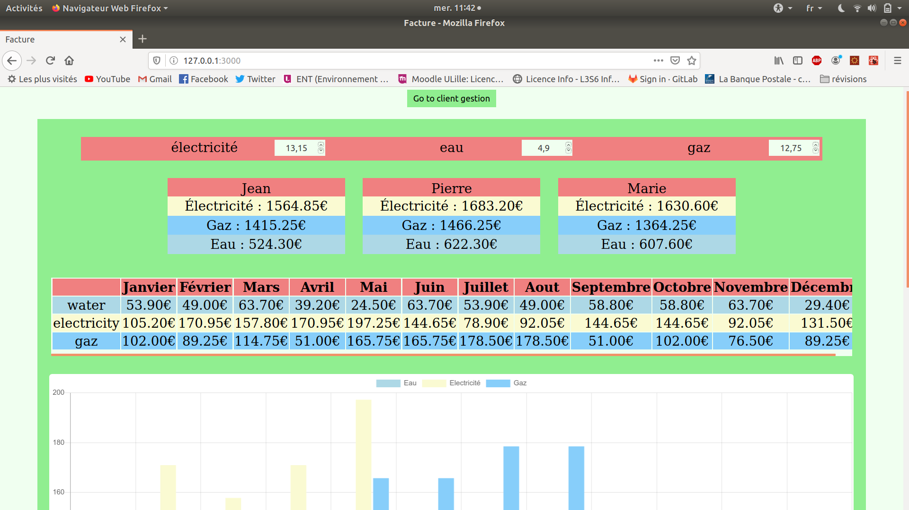

# Projet 3 : Factures

  

## Récupérer le projet

Dans votre dossier cloné avec git, tapez la commande `git pull`  
Le projet se situe dans le dossier ***/Factures***

## Hiérarchie du projet

- Dossier ***/img_readme*** : des images pour ce readme
- Dossier ***/controllers*** : controlleurs 
- Dossier ***/routes*** : routeurs
- Dossier ***/views*** : (inutile dans ce projet) vues jade
- Dossier ***/public*** : css et `index.html`
- Dossier ***/components*** : composants React
- Dossier ***/models*** : les modèles de données de notre base
- Dossier ***/data*** : données de la base dMongo
- reste : fichiers pour Node/Readme/Config...

## À savoir

Nous n'avons pas importé de données pour les clients car pour chaque client les tableaux de nombres sont liés à chaque ressource par l'_id de cette dernière, que nous ne pouvons pas deviner avant l'importation des ressources dans la base.
Quand on supprime un client, il y une erreur "SyntaxError: "JSON.parse: unexpected end of data at line 1 column 1 of the JSON data" mais le client est supprimé quand même. 

## Installer les modules, créer le bundle webpack, démarrer le serveur de base de données et lancer le serveur Node

Dans le dossier ***/Factures***, ouvrez un terminal et tapez la commande `make step1`, ce qui va installer les modules, créer le bundle webpack et lancer le serveur de base de données.
Toujours dans le dossier ***/Factures***, ouvrez un deuxième terminal et tapez la commande `make step2`, ce qui va importer les données dans la base pour les ressources et lancer le serveur node. 

### Installer les modules

Dans le dossier ***/Factures***, tapez la commande `npm install`.  

### Créer le bundle webpack

Dans le dossier ***/Factures***, tapez la commande `npm run build`.

### Démarrer le serveur node

Dans le dossier ***/Factures***, tapez la commande `npm start`.

### Démarrer le serveur de base de données Mongo

Dans le dossier ***/Factures***, tapez la commande `mongod --dbpath data`.  

## Lancer le projet

Une fois que tout est en place, tapez la commande `firefox 127.0.0.1:3000 &`.  
Où bien, tapez directement dans la barre du navigateur `127.0.0.1:3000 &`.

## Nettoyer le répertoire

Pour nettoyer le répertoire, dans le dossier ***/Factures***, tapez la commande `make clean`  
Les modules, le bundle et la base de données seront supprimés de votre répertoire.

Fin.
