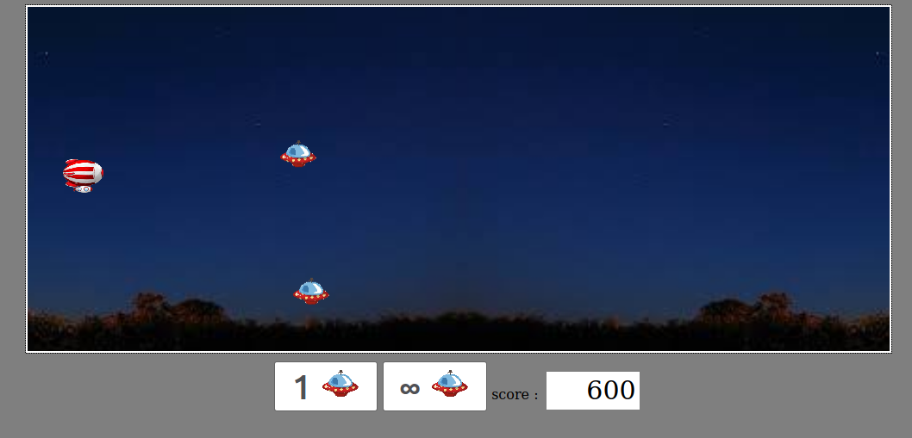

# Projet 1 : Starship

  

## Récupérer le projet

Dans votre dossier cloné avec git, tapez la commande `git pull`  
Le jeu se situe dans le dossier ***/Starship***

## Hiérarchie du projet

- Dossier ***/dist*** : Répertoire pour webpack
- Dossier ***/images*** : images du jeu
- Dossier ***/scripts*** : Scripts javascript du projet
- Dossier ***/style*** : fiches CSS du projet
- reste : fichiers pour Node/Readme/Config...

## Installer les modules et créer le bundle webpack

Dans le dossier ***/Starship***, tapez la commande `make all` ou `make`.  
Les modules sont installées dans le dossier ***/node_modules***  
`make all` ou `make` installent les modules et créent le webpack, mais il est possible de faire cela séparemment.

### Installer les modules

Dans le dossier ***/Starship***, tapez la commande `make install`.  

### Créer le bundle webpack

Dans le dossier ***/Starship***, tapez la commande `make build`.  

## Lancer le jeu

Dans ***/Starship***, tapez la commande `firefox dist/index.html &`

## Nettoyer le répertoire

Pour nettoyer le répertoire, dans le dossier ***/Starship***, tapez la commande `make clean`  
Les modules et ce qui a été généré par webpack sont supprimés de votre répertoire.

Fin.